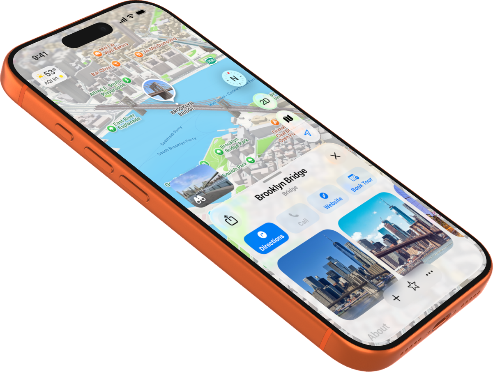

# 3D Screenshot Generator for Apple Devices

* Generates 3D renders of iOS app screenshots on iPhone 17 Pro / Max, and iPad Pro 13" devices.
* Automatically downloads the Apple AR USDZ files on first launch. Uses Apple’s files for maximum accuracy.
* Supports portrait and landscape orientations.
* Supports color choice for iPhone 17 Pro devices
* Supports arbitrary rotation of the 3D model.
* CLI tool so you can drive it from your favorite agent.


## Install From Binary

1. Download the signed and notarized macOS release zip from GitHub releases.
2. Copy the `3dsg` binary to somewhere in your $PATH


## Install From Source

```sh
git clone https://github.com/benmcdowell/3dsg.git
cd 3dsg
make install
3dsg --version
```

`make install` builds the release executable and installs it to `$HOME/.local/bin/3dsg` by default. Make sure `$HOME/.local/bin` is on your `PATH`.

You can choose another install location:

```sh
make install BINDIR=/usr/local/bin
```

## USDZ Asset Storage

The Apple USDZ assets are managed automatically. If the required asset is missing when the tool runs, it is downloaded from Apple and saved to:

`~/Library/Application Support/com.benmcdowell.3dsg/usdz`


## Usage

```sh
3dsg \
  --device iphone-17-pro \
  --color cosmic-orange \
  --rotation -30,45,30 \
  --screen ./Tests/Resources/iphone-17-pro-portrait.png \
  --size 1200x1200 \
  --output sample.png
```



Supported devices:
- `iphone-17-pro`
- `iphone-17-pro-max`
- `ipad-pro-13-inch`

Supported iPhone 17 Pro colors:
- `cosmic-orange`
- `deep-blue`
- `silver`
